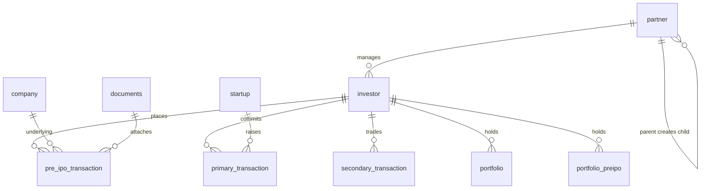

# Database Overview

## Engine

- MySQL (`DB_CONNECTION=mysql`)
- Migrations: `database/migrations/` (~363 files)
- Seeder: minimal (`database/seeders` — largely rely on admin setup / existing DB)
- Soft conventions: many tables are **singular** names (`investor`, `company`, `partner`)

## Domain map

Partner network detail (types including Institution, Seller target role, hierarchy): [new-system/database/partner.md](../new-system/database/partner.md). `partner.type` and `partner.parent_type` include `Institution`. An Institution company submit sets nullable `company.submitted_by_partner_id` and leaves `submitted_by_seller_id` null. An Institution deal sets nullable `company_deals.created_by_partner_id` and leaves `created_by_seller_id` null. `company_deals.base_price` (nullable decimal 15,2) is the amount entered on create. `company_deals.share_price` is that base plus the admin processing fee. Institution, seller, and admin deal creates do not write `seller_company_share_price`. A non-hot create upserts today's `company_share_price` from non-deleted, not-expired, non-hot deals (`price` = minimum sell `share_price`, or the buy price when there is no sell; `distributer_price` = minimum buy `share_price`, or the sell price when there is no buy; `base_price` = minimum sell base, otherwise buy) and dispatches `CalcuatePricingAutoJob` once. Hot deals are excluded from that history.

## Key tables ↔ models (non-exhaustive)

### Actors
| Table | Model |
|-------|-------|
| `investor` | `InvestorModel` (`is_self` boolean, default 0; one self row per new partner except Relation Manager) |
| `partner` | `PartnerModel` |
| `startup` | `StartupModel` |
| `user_admin` | `UserAdminModel` |
| `seller_master` | `SellerMasterModel` (`is_primary_access`, `is_secondary_access`, `is_preipo_access`) |

### Markets & content
| Table | Model |
|-------|-------|
| `company` | `CompanyModel` (+ `type`) |
| `temp_company` | `TempCompanyModel` (AI AutoWork staging) |
| company price/news/* | matching `Company*Model` |
| startup* | `Startup*Model` family |

### Transactions
| Table | Model |
|-------|-------|
| `pre_ipo_transaction` | `PreIpoModel` |
| `primary_transaction` | `PrimaryTransactionModel` |
| `secondary_transaction` | `SecondaryTransactionModel` |
| secondary sell/payments/escrow/transfer | matching models |
| `portfolio` / `portfolio_preipo` | portfolio models |

### KYC / banking
Investor KYC/demat/bank/AIF models as listed in [features/kyc-demat.md](../features/kyc-demat.md).

### Comms / API infra
| Table | Model |
|-------|-------|
| API header tokens | `ApiTokenForHeaderAuthModel` |
| `api_log` | `ApiLogModel` |
| `api_clients` | `ApiClient` (+ `is_ai`) |
| WhatsApp/email/SMS reports | `ReportMessages*` |
| device tokens | `CoreFirebaseDeviceTokenModel` |
| `app_settings` | `AppSettingsModel` |

## Migrations guidance

- Prefer new migrations over editing old ones already applied in shared environments.
- When adding columns used by APIs (e.g. `company.type`), update Enum + API docs + feature docs together.

## Unknowns

- No single schema dump in repo; infer from models + migrations.
- Some legacy tables may exist without active code paths — verify `grep` before dropping.

## Related

- Feature docs under `docs/features/`
- [architecture/cross-cutting-risks.md](../architecture/cross-cutting-risks.md)
