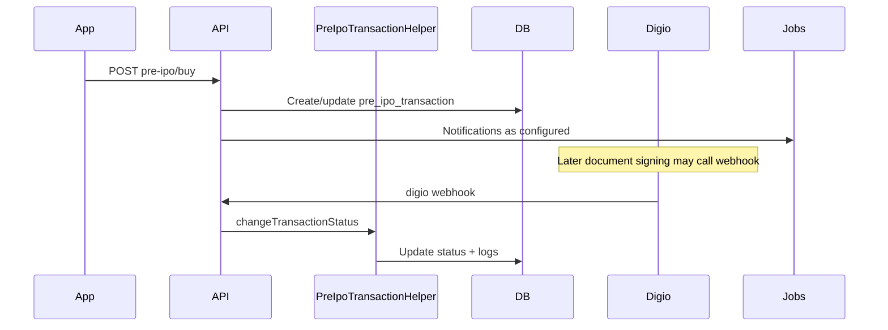

# Feature: Pre-IPO / Unlisted Equity

## Purpose

Enable investors (and partners) to buy/sell pre-IPO / unlisted company shares, track transaction status, portfolios, and market listings.

## Responsibilities

- Company discovery (home, trending, exclusive, liquid, DRHP, etc. via `PreIpoCategoryEnum`)
- Buy / sell / cancel orders
- Payment receipt upload
- Transaction detail + status timeline for apps
- Portfolio Pre-IPO holdings
- Admin operational management
- Optional timers / reminders / auto-cancel (commands exist; some schedules disabled)

## Entry points

| Kind | Location |
|------|----------|
| API V1 investor | `/api/v1/investor/pre-ipo/*` |
| API V1 business | `/api/v1/business/pre-ipo/*` |
| API V2 investor | `/api/v2/investor/pre-ipo/*`, `get-preipo-home`, etc. |
| API V2 business | `/api/v2/business/home/pre-ipo`, `home/secondary`, `pre-ipo/transaction-list`, `pre-ipo/transaction/detail`, `pre-ipo/transaction/cancel`, `pre-ipo/transaction/payment-receipt`, `pre-ipo/transaction/confirm-share-transfer`, `POST pre-ipo/buy`, Institution `GET institution/dashboard`, Institution `institution/pre-ipo/transaction*`, company list, `enquiries/create` |
| API V2 seller | `/api/v2/seller/dashboard`, `/api/v2/seller/pre-ipo/transaction`, `transaction/detail` (scoped to `seller_id`) |
| Admin | `/admin/pre-ipo-transactions`, `/admin/company-enquiry` |
| Helpers | `PreIpoTransactionHelper`, `TransactionCalculationHelper` |
| Services | `PreIpoTimerService`, `PreIpoBusinessDayService` |

## Important models / tables

| Model | Table |
|-------|-------|
| `PreIpoModel` | `pre_ipo_transaction` |
| `PreIpoSellRequestModel` | (see model `$table`) |
| `PreIpoTransactionPaymentsModel` | payments |
| `PreIpoStatusLogModel` | status logs |
| `PortfolioPreIpoModel` | `portfolio_preipo` |
| `CompanyModel` | `company` (+ `type`: unlisted/secondary) |
| `SellerMasterModel` | `seller_master` (Pre-IPO counterparty KYC + Flutter seller API login via Sanctum; optional `logo` path under `seller/logo/`; feature flags `is_primary_access`, `is_secondary_access`, `is_preipo_access` like investor) |
| `CompanyGrabOpportunitySlotModel` | grab slots |
| `CompanyEnquiryModel` | `company_enquiries` (partner buy/sell enquiry on company/deal) |

## Data flow (buy — conceptual)

## Business rules

- Admin seller CRUD (`/admin/seller`) supports optional `logo` upload stored on `seller_master` under `seller/logo/`. Seller V2 login/profile/forgot and `POST /profile/update` return `logo` as an absolute URL; when unset, initials are generated from `company_name` via ui-avatars (not a static square placeholder).
- Seller feature access mirrors investor: `is_primary_access`, `is_secondary_access`, `is_preipo_access` on `seller_master` (defaults `0`; admin create/edit toggles; existing rows backfilled to `1` by migration).
- `company.type` separates **unlisted** vs **secondary** markets for business v2 list/home/news APIs — do not mix payloads. See `docs/preipo-v2-unlisted-secondary-api-changes.md`.
- DRHP list filter (`category=DRHP`) matches `is_drhp=1` and excludes Coming Soon / Listed, but must still return rows where `category` is null (explicit `whereNull` — SQL `!=` drops nulls).
- V2 status timelines for old orders (`order_step` null) use `PreIpoTransactionHelper::getStatusListForApplicationV2`. A row with `order_step` set on the partner and Institution list/detail routes returns the order-step object (`current_step`, `next_step`) and does not include `status_list`.
- Transaction calculations: `POST .../pre-ipo/calculate-transaction` → `TransactionCalculationController`.
- V1 buy (`POST .../pre-ipo/buy`): optional `seller_id` (scalar or parallel array) saved on new `pre_ipo_transaction` rows.
- V2 business buy (`POST /api/v2/business/pre-ipo/buy`, `partner-api-guard`): one request places one or more orders. Each row stores the deal, the Institution that created the deal (`partner_id` = `company_deals.created_by_partner_id`), that Institution’s self investor (`seller_investor_id`), and `order_step` `mandate_pending`. Integer `status` stays `0` and is not the step machine for these rows. A buy mandate (`BuyMandate`) is sent on create. If Digio fails, the order remains and the message is `Orders placed. The buy mandate could not be sent.` The printed mandate expiry is 7 days after `created_at`. `seller_id` is left null. The client investor must be one this partner can act for (same scope as `GET /api/v2/business/investor`). The deal must be a non-deleted, not-expired, available sell deal with `created_by_partner_id` set. `available_quantity` is not decremented. No coupons. Existing V1 buy and V2 investor buy stay unchanged.
- Three prices on a partner order: `base_price` is the Institution amount on the deal (example 99). `distributer_price` is the deal `share_price` (example 100, base plus the admin processing fee). `share_price` is the final price the partner quotes the investor (example 102). The partner keeps `share_price - distributer_price` per share. The Private Deals fee sits inside `distributer_price` (`distributer_price - base_price`). `investment_amount` and `payable_amount` are `shares * share_price`.
- Admin approve still moves status `0` to `2` (approve) or `0` to `1` (reject). When `partner_id` is already set, seller is not required and `seller_id` is not written. Older rows without `partner_id` still require a seller on approve. The status list, step titles, and later accept/reject/payment/share-transfer steps are unchanged. Bank-detail messages that read `seller` stay empty on Institution orders.
- Institution dashboard (`GET /api/v2/business/institution/dashboard`): only `partner.type` Institution. Orders use `PreIpoOrderStepService::institutionQuery` (this Institution's `partner_id`, `order_step` set, `mandate_pending` excluded, unsigned cancelled orders hidden). Counts use `order_step`: pending is `share_confirmation_pending`; processing is deal slip, payment, payment confirmation, share transfer, and share-transfer confirmation; completed is `completed`. A cancel after a signed mandate is omitted from those counts and can appear in recent transactions. `summary.deals.available`, `summary.deals.expired`, `charts.deals_by_status`, and `recent.deals` are this Institution's hot deals only (`is_hot_deal` = true). `pending_approval` is this Institution's submissions. `total_companies` is the approved catalog. `price_uploaded_today` is distinct approved companies where this Institution created a non-deleted normal deal today (`is_hot_deal` = false, `created_at` today). Hot deals, older normal deals, and other Institutions' deals do not count. `price_not_uploaded_today` is `total_companies` minus that count (minimum 0). This does not read `seller_company_share_price`. Field-level payload: [institution.md](../api/institution.md).
- Coupons may apply on V2 investor buy paths — verify coupon enums/scopes. This partner buy route does not accept coupons.

## Configuration / schedule

- Commands: `AutoCancelPreIpoTransactions`, reminder/escalation commands under `app/Console`
- Many related schedules in `routes/console.php` are commented out
- Active: `app:dispatch-preipo-transaction-reminder-message` daily 11:30

## Common modification points

- Response shaping for home/lists: V2 investor/business `CommonController`
- Status machine: `PreIpoTransactionHelper`
- Admin ops UI: `PreIpoTransactionController`

## Side effects / risks

- Changing buy validation affects investor **and** partner apps (shared controller methods on V1).
- Digio + document type changes affect status progression.
- Share price jobs update company valuations used in home widgets.

## Related features

- [companies-pricing.md](companies-pricing.md)
- [portfolio.md](portfolio.md)
- [kyc-demat.md](kyc-demat.md)
- [coupons-referrals.md](coupons-referrals.md)
- [workflows/pre-ipo-buy-sell.md](../workflows/pre-ipo-buy-sell.md)
- [workflows/pre-ipo-order-steps.md](../workflows/pre-ipo-order-steps.md) is the live partner/Institution step flow for rows with `order_step` set. It does not extend status `0`–`5`. Orders with `order_step` null still use status `0`–`5`. Notification matrix: [pre-ipo-order-notifications.md](pre-ipo-order-notifications.md).
