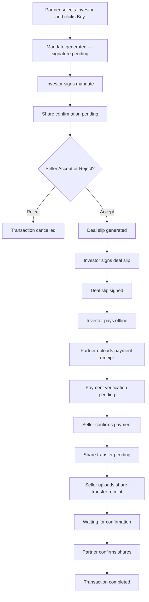

# Transaction diagrams

**Audience:** Internal team and business stakeholders  
**Scope:** Buy transaction lifecycle (mandate → accept/reject → deal slip → payment → share transfer → complete)

**App mapping**

| Type | Application |
|------|-------------|
| **Partner** | Wealth Manager channel app |
| **Institution** | Private Deal Seller app |

Buyer-side or seller-side can be Partner or Institution. Diagrams use **Partner** (buyer-side ops), **Investor**, **Seller**, and **System**.

---

## Diagrams

| Diagram | Open |
|---------|------|
| Use case | [use-case.md](use-case.md) |
| Activity | [activity.md](activity.md) |
| Swimlane activity | [swimlane.md](swimlane.md) |
| PlantUML sources | [plantuml/](plantuml/) |

---

## Who does what

| Action | Who |
|--------|-----|
| Select investor + click Buy | **Partner** (buyer-side) |
| Sign buy **mandate** | **Investor** |
| Accept / Reject mandate (confirm shares) | **Seller** |
| Sign **deal slip** | **Investor** |
| Pay amount offline | **Investor** |
| Upload **payment receipt** | **Partner** (buyer-side) |
| Confirm payment received | **Seller** |
| Upload **share-transfer receipt** | **Seller** |
| Confirm shares received (complete) | **Partner** (buyer-side) |

Investor only signs mandate, signs deal slip, and pays offline. Other buyer-side actions are done by the Partner.

---

## Status and next step

| Phase | Current status | Next (investor / partner) | Next (seller) |
|-------|----------------|---------------------------|---------------|
| After Buy | Mandate generated — signature pending | Investor signs mandate | — |
| After mandate signed | Share confirmation pending | NA | Accept or Reject |
| Reject | Transaction cancelled | — | — |
| Accept | Deal slip generated | Investor signs deal slip | Waiting for deal slip signature |
| After deal slip signed | Deal slip signed | Investor pays offline; Partner uploads receipt | — |
| After payment receipt uploaded | Payment receipt uploaded | — | Payment verification pending |
| After seller confirms payment | Share transfer pending | — | Upload share-transfer receipt |
| After share-transfer receipt uploaded | Share transfer receipt uploaded | Partner confirms shares | Waiting for confirmation |
| After Partner confirms | Transaction completed | — | — |

---

## Flow (summary)

Back to [START-HERE](../../START-HERE.md) · [Business diagrams](../README.md)
