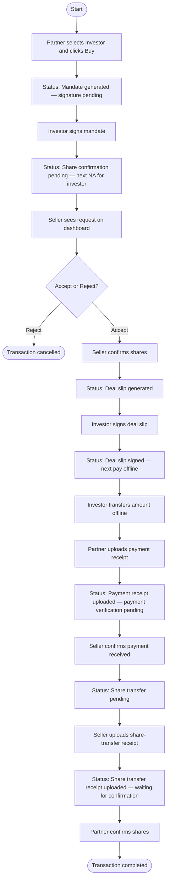

# Activity — Transaction (buy)

Editable PlantUML: [plantuml/activity-transaction.puml](plantuml/activity-transaction.puml)

Single end-to-end activity (no swimlanes). Reject path ends in cancelled.

---

## Diagram

---

## Status checkpoints

1. Mandate generated — signature pending  
2. Share confirmation pending (seller Accept/Reject)  
3. Deal slip generated — investor signs  
4. Deal slip signed — investor pays; Partner uploads receipt  
5. Payment receipt uploaded — payment verification pending  
6. Share transfer pending — seller uploads share-transfer receipt  
7. Share transfer receipt uploaded — waiting for confirmation  
8. Transaction completed  

Related: [use-case.md](use-case.md) · [swimlane.md](swimlane.md) · [README.md](README.md)
