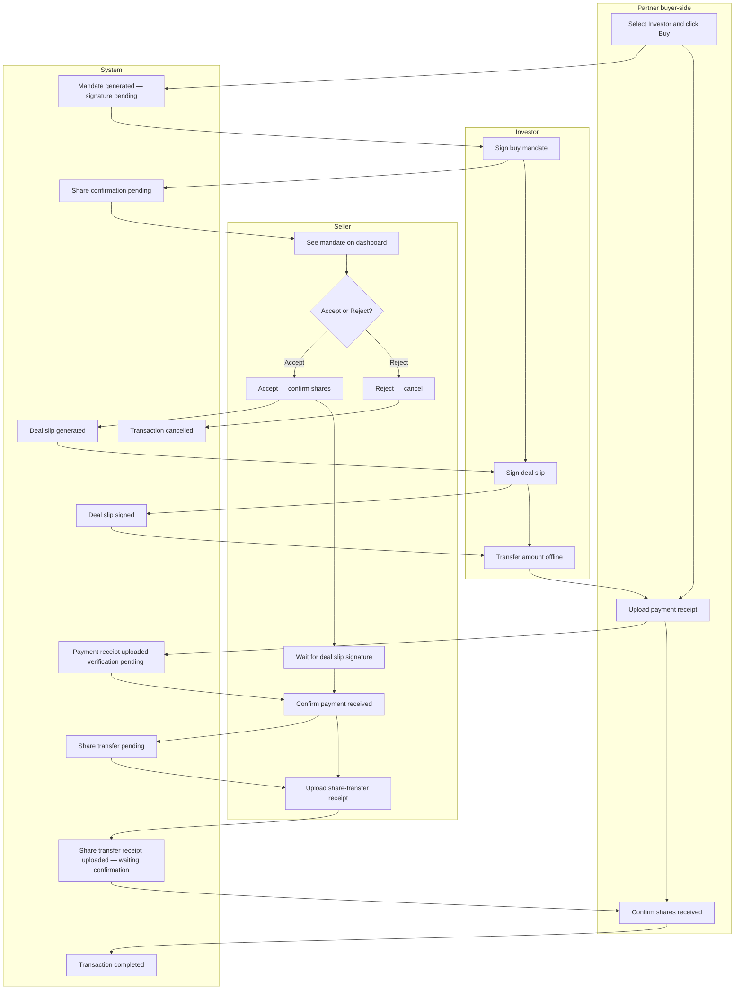

# Swimlane activity — Transaction (buy)

Editable PlantUML: [plantuml/swimlane-transaction.puml](plantuml/swimlane-transaction.puml)

Lanes: **Partner** · **Investor** · **Seller** · **System**

---

## Diagram

---

## Lane summary

| Lane | Responsibilities |
|------|------------------|
| **Partner** | Start buy; upload payment receipt; final share confirmation |
| **Investor** | Sign mandate; sign deal slip; pay offline |
| **Seller** | Accept/Reject; wait for slip signature; confirm payment; upload share-transfer receipt |
| **System** | Status transitions and deal slip generation |

Related: [activity.md](activity.md) · [use-case.md](use-case.md) · [README.md](README.md)
