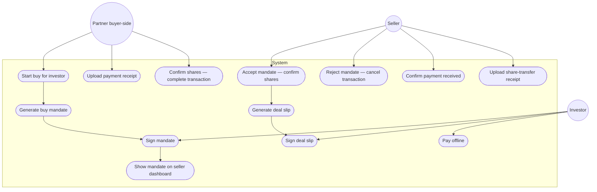

# Use case — Transaction (buy)

Editable PlantUML: [plantuml/use-case-transaction.puml](plantuml/use-case-transaction.puml)

**Mapping:** Partner ≈ Wealth Manager app · Institution ≈ Private Deal Seller app. Seller in a deal may be Partner or Institution.

---

## Diagram

---

## Actors and use cases

| Actor | Use cases |
|-------|-----------|
| **Partner** (buyer-side) | Start buy for investor; upload payment receipt; confirm shares / complete |
| **Investor** | Sign mandate; sign deal slip; pay offline |
| **Seller** | Accept mandate; reject/cancel; confirm payment; upload share-transfer receipt |
| **System** | Generate mandate; generate deal slip; update statuses |

---

## Notes

- One **buy mandate** document from investor to seller party (not separate buy/sell agreements).
- After accept, deal slip is sent to the **investor** to sign.
- Status labels: see [README.md](README.md).

Related: [activity.md](activity.md) · [swimlane.md](swimlane.md)
