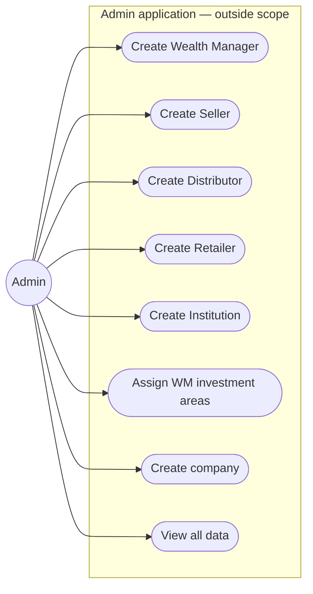
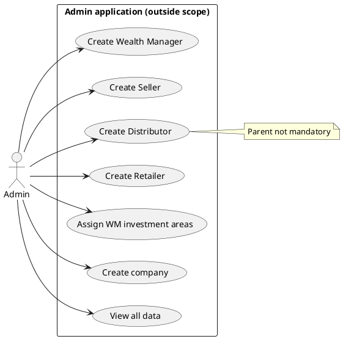

# Use cases — Admin

Admin is an **external supporting actor**. The Admin application is outside this project’s available scope. Admin can **view all data**.

Editable PlantUML: [../plantuml/use-case-admin.puml](../plantuml/use-case-admin.puml)

---

## Diagram (Mermaid)

---

## Responsibilities (confirmed)

| Use case | Notes |
|----------|--------|
| Create Wealth Manager | Yes — CML KYC is required and saved on the self investor. If KYC fails, creation rolls back. |
| Create Seller | Yes |
| Create Distributor | Yes — parent **not** mandatory. CML KYC is required and saved on the self investor. |
| Create Retailer | Yes — parent **not** mandatory. CML KYC is required and saved on the self investor. |
| Create Institution | Yes — same admin form as Distributor, optional Wealth Manager parent, plus required CML KYC saved on the self investor. Institution can create an unlisted or secondary company that is approved and live for partners immediately, and can use the Institution company catalog, submissions, promoters, shareholders, and deals APIs. Seller share-price quotes stay on the seller app. Partner API cannot create the Institution account. |
| Assign WM investment areas | Primary / LP Secondary / Unlisted — one, two, or all |
| Create company | Shared company records |
| View all data | Yes |

**Out of current Admin scope:** create Investors; create Relationship Managers.

---

## PlantUML source

