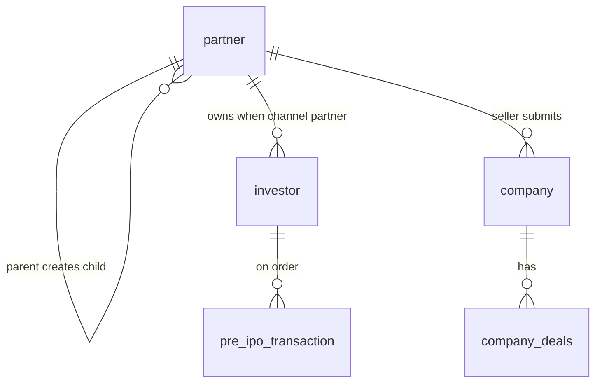

# Database: Partner network (new system)

**Stakeholders:** diagram + roles below.  
**Start:** [START-HERE](../START-HERE.md)

---

## Relationship picture

---

## Roles (target)

| Type | Kind | Created by | Own investors | Notes |
|------|------|------------|---------------|--------|
| Wealth Manager | Channel partner | Admin | Yes | Inv, Relationship Manager, Dist, Retailer. **Not Seller**. One self investor on create. |
| Seller | Inventory | Admin | No | **No child users** |
| Distributor | Channel partner | Admin or WM | Yes | Retailers + Relationship Manager. One self investor on create. |
| Retailer | Channel partner | Admin, WM, or Distributor | Yes | Investors only. One self investor on create. |
| Relationship Manager | RM | WM or Distributor | Assigned only | Does not get a self investor. Uses the parent partner’s investor. |
| Institution | Partner type in code | Admin only | Self investor on create | Stored as `Institution` on `partner.type`. Same admin form as Distributor (optional Wealth Manager parent, commission, investment-area flags). Partner portal and partner API cannot create it. An Institution can create an unlisted or secondary company that is approved and live for partners immediately (`company.submitted_by_partner_id`, `approval_status=approved`, `status=0`), list that catalog, read detail, list its submissions, replace promoters and shareholders, and manage company deals. Seller share-price quotes stay on the seller app. |

---

## Plain rules

- Admin creates WM, Seller, Distributor, Retailer, and **Institution**
- Institution is implemented in `PartnerTypeEnum` and the admin partner screens. Creating an Institution also creates one self investor. Who else an Institution can create is not decided.
- The partner API rejects creating a partner with `partner_type = Institution`
- An Institution partner can create a company (`unlisted` or `secondary`) that is approved and live for partners immediately. The company row stores `approval_status=approved`, `status=0`, `submitted_by_partner_id`, and leaves `submitted_by_seller_id` null. Catalog, detail, submissions, promoters, shareholders, and deals are on the Institution company API. Seller share-price quotes stay on the seller app.  
- WM **cannot** create Seller  
- Seller **cannot** create any user  
- RM under WM/Distributor for company data and investor assignment  
- Investors only under WM / Distributor / Retailer
- Each new Wealth Manager, Distributor, Retailer, and Institution gets one self investor (`investor.is_self = 1`, default 0) for their own orders. That row is hidden from partner client lists and admin investor lists. Relation Manager does not get one and uses the parent partner’s investor. Partner login and profile include `self_investor_id` (null for Relation Manager).
- Admin create for Wealth Manager, Distributor, Retailer, and Institution also requires CML KYC. That KYC is saved on the self investor at creation (`investor_kyc_demat`, PAN, bank when present, CML document, `preipo_kyc_status = 1`). If the CML is missing or the KYC save fails, partner creation rolls back. Relation Manager admin create does not include CML and does not create a self investor. Partner API create does not collect CML.  

---

## Related tables (seller commercial)

| Concept | Role |
|---------|------|
| company | Seller create, or Institution create (`submitted_by_partner_id`); approved and live for partners immediately (`approval_status=approved`, `status=0`); duplicate check |
| bank / demat | Multiple; on deal / transaction |
| company_deals | Select selling company |
| investment transaction | Deal slip bank + demat |

---

## Related

- [Hierarchy](../workflows/flows/wm-create-seller-distributor.md)
- [Actors](../actors/README.md)
- [Database overview](../../database/overview.md)
- [Diagrams](../diagrams/README.md)
