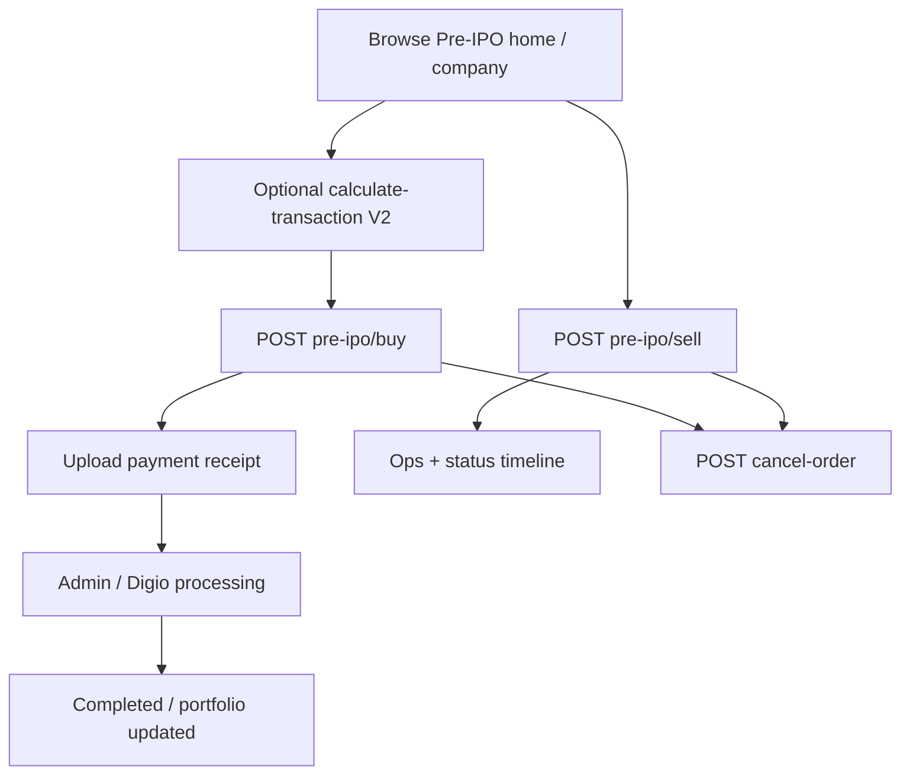

# Workflow: Pre-IPO Buy / Sell

## Entry APIs

- V1/V2 investor + V1 business buy/sell/cancel
- V1 `POST pre-ipo/buy` accepts optional `seller_id` (integer for all rows, or parallel array) — stored on `pre_ipo_transaction.seller_id` at create time
- V2 business `POST /api/v2/business/pre-ipo/buy` (`partner-api-guard`) places one or more orders in one database transaction. Body is `orders[]` of `deal_id`, `investor_id`, `shares`, and `share_price`. It does not accept `distributer_price`, `payment_mode`, `is_distributer`, `seller_id`, `partner_id`, or coupons. Any failed item rejects the whole request and inserts nothing.
- On each partner order: `status = 0`, `company_id` from the deal, `deal_id`, `partner_id` = the Institution on the deal, `seller_investor_id` = that Institution’s self investor, `seller_id` null, `base_price` = deal `base_price`, `distributer_price` = deal `share_price`, `share_price` = the partner’s quoted price, `is_distributer` true, `payment_mode` `RTGS`. Example: base 99, distributer 100, quoted share 102.
- The partner order does not change the status machine. Admin approve still goes `0 → 2` and reject `0 → 1`. Institution rows (`partner_id` set) do not need a seller master row.
- V2 payment receipt upload + calculate
- Status detail endpoints for timelines

## Core code

- Controllers: V1/V2 Investor `CommonController` (`preIpoBuy`, `preIpoSell`, `cancelOrder`, …); V2 Business `CommonController::preIpoBuy` for partner orders
- `PreIpoTransactionHelper`, `TransactionCalculationHelper`
- Model: `PreIpoModel` (`pre_ipo_transaction`)
- Admin: `PreIpoTransactionController`

## Preserve

- Status list helpers for mobile steppers (unchanged for partner orders)
- Coupon application rules on V2 investor buy (partner `POST pre-ipo/buy` has no coupons)
- `company.type` filtering on business discovery APIs
- Notification jobs on buy/cancel

## Related

- [features/pre-ipo.md](../features/pre-ipo.md)
- [api/v2.md](../api/v2.md)
- [pre-ipo-order-steps.md](pre-ipo-order-steps.md) is the live partner/Institution step flow. New V2 partner buys set `order_step` and leave integer `status` at `0`. Orders with `order_step` null still use status `0`–`5`.
