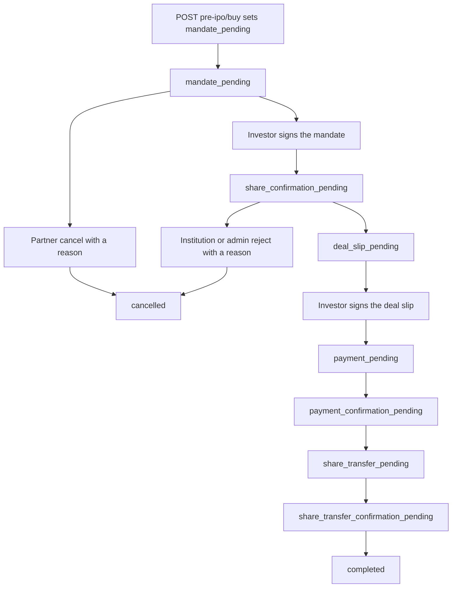

# Workflow plan: Pre-IPO partner order steps

**Status:** Implemented for orders from `POST /api/v2/business/pre-ipo/buy`. `order_step` null still means an old order on integer `status` `0`–`5`.

New orders from `POST /api/v2/business/pre-ipo/buy` use a new nullable string column, `order_step`, on `pre_ipo_transaction`. Each new order has one step value. Null means an old order that still uses integer `status` `0`–`5`.

New orders do not move `status` through the old machine. On create, set `order_step` to `mandate_pending` and leave `status` at `0`. That `0` keeps its old meaning (“processing”) for old orders only. New APIs must not read `status` when `order_step` is set. Do not give `0` a second meaning, and do not extend `0`–`5` with `6`, `7`, or `8`.

Order creation already stores `deal_id`, `partner_id` (the Institution that owns the deal), `seller_investor_id` (that Institution’s self investor), `seller_id` null, `base_price` from the deal, `distributer_price` from the deal share price (base plus the processing fee), and `share_price` as the buying partner’s quoted price. Pricing stays as it is. `seller_id` stays null.

The older stakeholder diagram in [new-system/business-diagrams/transaction/README.md](../new-system/business-diagrams/transaction/README.md) is unchanged. This file is the implementation plan.

Live behaviour for old orders is still integer `status` `0`–`5`, with `current_status` and `next_step` from `PreIpoModel`, and the app timeline from `PreIpoTransactionHelper::getStatusListForApplicationV2` (V2) and `getStatusListForApplication` (older list). See [pre-ipo-buy-sell.md](pre-ipo-buy-sell.md).

## Actors

| Actor | Who | What they do |
|-------|-----|----------------|
| Buying partner | Wealth Manager, Distributor, or Retailer who placed the order for an investor | Uses partner APIs. Sees the order from creation, including `mandate_pending`. |
| Investor | The client on the order (`investor_id`) | Signs the buy mandate and the deal slip. Pays outside the system. |
| Institution | The deal owner (`pre_ipo_transaction.partner_id`, `partner.type` Institution) | The order stays hidden through `mandate_pending`, and stays hidden if it is cancelled from that step. From `share_confirmation_pending` the Institution approves or rejects, confirms payment, and uploads the share-transfer receipt. |
| Admin | Admin with Pre-IPO transaction access | Performs the same moves as the Institution. Admin can see the order during `mandate_pending`. |

If the order investor is that buying partner’s self investor (`investor.is_self = 1` and `investor.partner_id` is the buying partner), the partner app shows the sign link on the order as well as sending the link to that investor. The Institution self investor (`seller_investor_id`) is a different person and is not the signer.

The buying partner is not stored as their own column. `partner_id` on the order is the Institution. The buying partner is the partner who owns the investor, which is how `GET /api/v2/business/pre-ipo/transaction-list` already scopes its list (`investor.partner_id` = the logged-in partner).

## Old status readers must skip these rows

`order_step` null is the old machine. `order_step` set is the new machine. Old screens, helpers, and jobs that switch on integer `status` must ignore rows where `order_step` is not null. If they do not, a new order left at `status` `0` is misread as “Processing” / “Waiting for order confirmation” and can be approved or auto-cancelled by the old path.

These must skip `order_step` is not null (filter with `whereNull('order_step')`, or return before the status switch):

- `PreIpoModel::getCurrentStatusAttribute`
- `PreIpoModel::getNextStepAttribute`
- `PreIpoModel::getPercentageAttribute` and `getIsProcessingAttribute` (same appends; `status` `0` would show 0% and in progress)
- `PreIpoTransactionHelper::getStatusListForApplicationV2` and `getStatusListForApplication`
- Admin approve / reject on status `0` in `PreIpoTransactionController` (the status form and the pending list that queries `status` `0`)
- Auto-cancel and the other status-keyed commands: `AutoCancelPreIpoTransactions` (`preipo:auto-cancel`, status `2` or `3`), `AdminPendingReminderCommand` (`preipo:admin-pending-reminder`, status `0`, and it sets status `1` when its timer is past), `InvestorDeadlineReminderCommand`, `InvestorMorningDeadlineReminderCommand`, `ShareTransferEscalationCommand`, and `PreIpoTimerService` stage timers

New list and detail responses do not call those attributes. `current_step` and `next_step` are labels derived from `order_step` plus who is looking (buying partner vs Institution). Admin uses the Institution labels and is not hidden before the mandate is signed. Do not reuse the old `switch ($this->status)` statements. Do not also send the old appended `current_status` or `next_step`.

An `order_step` row on the partner list, partner detail, Institution list, and Institution detail is only this object:

`id`, `transaction_invoice_no`, `order_step`, `current_step`, `next_step`, `action` (array or null), `sign_link` (or null), `investor` (`id`, `name`), `company` (`id`, `brand_name`, `logo`), `deal_id`, `shares`, `base_price`, `distributer_price`, `share_price`, `investment_amount`, `payable_amount`, `cancellation_reason` (or null), `payment_details` (or null before `payment_pending`), `payment_receipt` (or null), `share_transfer_receipt` (or null), `documents` (array of stored files, or `[]`), `created_at`.

It does not include `status_list`, `percentage`, `is_processing`, `deal_slip`, `approval_file`, `rejection_file`, or `seller_master` bank. `payment_details.account` is the Institution self investor CML bank. A partner list page can still include an old row (`order_step` null) in the previous shape, including `status_list`. The Institution list is new orders only.

## Step values

| `order_step` | Meaning |
|---|---|
| `mandate_pending` | Order placed. Buy mandate generated. |
| `cancelled` | Partner cancelled before sign, or Institution/admin rejected at share confirmation. Reason on `cancellation_reason`. Terminal. |
| `share_confirmation_pending` | Mandate signed. Institution can see the order from here. |
| `deal_slip_pending` | Institution or admin approved. Deal slip generated. |
| `payment_pending` | Investor signed the deal slip. Payment details sent. Payment is outside the system. |
| `payment_confirmation_pending` | Partner uploaded the payment receipt. |
| `share_transfer_pending` | Institution or admin confirmed payment. |
| `share_transfer_confirmation_pending` | Institution or admin uploaded the share-transfer receipt. |
| `completed` | Partner confirmed the share transfer. Shares go to the investor portfolio. Terminal. |



Cancel has two points only:

- The buying partner may cancel only from `mandate_pending`.
- The Institution or an admin may reject only from `share_confirmation_pending`.

Both write `order_step` = `cancelled` and `cancellation_reason`. Neither writes integer `status` `1`.

A `cancelled` order is “cancelled before sign” when it never reached `share_confirmation_pending`. That is a partner cancel from `mandate_pending`: there is no completed buy-mandate document. The Institution list and detail exclude `mandate_pending` and those cancelled-before-sign rows. A reject from `share_confirmation_pending` happens only after the mandate webhook has stored the signed mandate, so that cancelled order stays on the Institution list with the reason. Do not encode that history in `status`.

## Copy and actions

### `mandate_pending`

| Audience | Current | Next | Action |
|----------|---------|------|--------|
| Buying partner | Transaction initiated. Buy mandate generated. | Ask the investor to sign the mandate sent by SMS and WhatsApp. | Cancel with a reason, or wait for the signature. If the order investor is the partner’s self investor, also show the sign link. |
| Institution | The order is hidden. | None. | None. |
| Admin | Same current and next as the partner. | Same. | No approve or reject here. Admin is not hidden. |

### `cancelled`

| Audience | Current | Next |
|----------|---------|------|
| Buying partner | Transaction cancelled, with the reason. | None. |
| Institution | The same text, once they could see the order (rejected from `share_confirmation_pending`). A cancel from `mandate_pending` stays hidden. | None. |
| Admin | Transaction cancelled, with the reason. Admin could already see a cancel from `mandate_pending`. | None. |

### `share_confirmation_pending`

| Audience | Current | Next | Action |
|----------|---------|------|--------|
| Buying partner | Mandate signed. | Share confirmation pending. | None. |
| Institution and admin | Mandate signed. | Approve the transaction or cancel with a reason. | Approve or reject. |

Approve generates the deal slip and sets `deal_slip_pending`. Reject sets `cancelled` and stores the reason.

### `deal_slip_pending`

| Audience | Current | Next | Action |
|----------|---------|------|--------|
| Buying partner | Deal slip generated. | Ask the investor to sign the deal slip sent by SMS and WhatsApp. | If the order investor is the partner’s self investor, also show the sign link. |
| Institution and admin | Deal slip generated. | Waiting for the deal slip signature. | None. |

### `payment_pending`

| Audience | Current | Next | Action |
|----------|---------|------|--------|
| Buying partner | Deal slip signed. Payment details sent to the investor. | Upload the payment receipt. | View the payment details. |
| Institution and admin | Deal slip signed. Payment details sent to the investor. | Waiting for payment confirmation. | None. |

### `payment_confirmation_pending`

| Audience | Current | Next | Action |
|----------|---------|------|--------|
| Buying partner | Payment receipt uploaded. | Payment confirmation pending. | None. |
| Institution and admin | Payment receipt uploaded. | View or download the receipt and confirm the payment. | Confirm payment. |

### `share_transfer_pending`

| Audience | Current | Next | Action |
|----------|---------|------|--------|
| Buying partner | Payment received. | Waiting for share transfer. | None. |
| Institution and admin | Payment received. | Upload the share-transfer receipt. | Upload the receipt. |

### `share_transfer_confirmation_pending`

| Audience | Current | Next | Action |
|----------|---------|------|--------|
| Buying partner | Share transfer receipt uploaded. | Confirm the share transfer. | View or download the receipt. |
| Institution and admin | Share transfer receipt uploaded. | Waiting for share transfer confirmation. | None. |

### `completed`

| Audience | Current | Next |
|----------|---------|------|
| Buying partner, Institution, and admin | Transaction completed. | N/A |

On the move to `completed`, call `UtillsHelper::preIpoPortfolio($transaction)`. That helper finds or creates `portfolio_preipo` for the same `investor_id`, `company_id`, and `instrument`, adds the shares and investment amount, and stores the row id on `pre_ipo_transaction.portfolio_id`. Do not wait for the old admin path that writes the portfolio when status moves from `4` to `5`. Do not create another holdings table.

Suggested `action` names: `cancel`, `show_mandate_sign_link`, `show_deal_slip_sign_link`, `view_payment_details`, `upload_payment_receipt`, `confirm_share_transfer`, `approve`, `reject`, `view_payment_receipt`, `confirm_payment`, `upload_share_transfer_receipt`, `view_share_transfer_receipt`.

Self-investor orders include the active signer URL on detail when the action is a sign link.

## Documents

`DocumentTypeEnum::preIPO()` today is only approval, rejection, and deal slip. Add document type `BuyMandate` to that list. `DigioHelper::createMandateForm` is a primary-investment debit mandate (NACH-style) on `PrimaryTransactionModel`. This buy mandate is the Digio template sign request below.

### Buy mandate (`BuyMandate`)

Send it with the same call as `DocumentHelper::dealSlipDocumentSend`: `POST {digio_url}v2/client/template/multi_templates/create_sign_request`. The body has one template (`template_key`, `template_values`), `sign_coordinates`, one signer, and `notify_signers` true. The printed `mandate_expire_date` is the order date plus 7 days (`d M Y`). Digio `expire_in_days` `10` is the sign-link lifetime and is not that printed date.

The signer is the buying investor (`pre_ipo_transaction.investor_id`). `identifier` is `investor.mobile_number`. `name` is `investor.name`. `sign_type` is `electronic`. `dealSlipDocumentSend` also stores `user_id` and `user_type` (`InvestorModel`) on `documents_signers` and strips those two fields from the JSON sent to Digio. There is one signer. Seller lines in `template_values` come from the Institution self investor (`seller_investor_id`). Do not copy `seller_master` into this mandate.

On HTTP 200, save a `documents` row the same way as the deal slip: `api_id` is the Digio document id, `type` is `BuyMandate`, and `meta` holds the investor id and the `pre_ipo_transaction` id. Save `documents_signers.link` from `signing_parties[].authentication_url`. The investor does not get a new sign API. The partner app reads `documents_signers.link` for a self-investor order.

Template images are `{}`. The deal-slip request does not send an images object.

Digio template sign coordinates, signer index `0`, page `5`:

```json
{"0":{"5":[{"llx":173,"lly":562,"urx":303,"ury":607}]}}
```

The request `sign_coordinates` use the same shape as the deal slip: the key is the buying investor’s mobile, then the page, then the box. Signer index `0` is that mobile.

```json
{
  "<investor.mobile_number>": {
    "5": [{ "llx": 173, "lly": 562, "urx": 303, "ury": 607 }]
  }
}
```

`template_key`: `TMP261001115614894TJQ9LO6JORA2OZ`

| Template key | Source |
|---|---|
| `company_legal_name` | `company.company_name` |
| `company_type_of_shares` | `pre_ipo_transaction.instrument`. Partner buy sets this to `equity` (`InstrumentTypeEnum::equity`). `company` has no share-type column. `company.type` is `unlisted` or `secondary`. |
| `face_value` | `company_fundamentals.face_value` |
| `qty` | `pre_ipo_transaction.shares` |
| `share_price` | `pre_ipo_transaction.share_price` (the partner’s final quoted price) |
| `premium_price` | `share_price` minus `company_fundamentals.face_value`, the same calculation as `$getPremium` in `dealSlipDocumentSend`. `0` when face value is missing. |
| `mandate_date` | Order created date: `DateTimeHelper::viewDate(pre_ipo_transaction.created_at)`, format `d M Y`, the same helper the deal slip uses for `date`. |
| `mandate_reference_number` | `pre_ipo_transaction.transaction_invoice_no`. `POST /api/v2/business/pre-ipo/buy` does not set it. `PreIpoModel::boot` on `creating` fills it when empty (`TN-{n}-{2 chars}`). The mandate uses that value. |
| `mandate_expire_date` | Order created date plus 7 days: `DateTimeHelper::viewDate(created_at + 7 days)`, format `d M Y`. No column stores this date. Digio `expire_in_days` `10` is only the sign-link lifetime, not this printed date. |
| `investor_name` | Buying investor `investor.name` |
| `investor_email` | Buying investor `investor.email` |
| `investor_mobile` | Buying investor `investor.mobile_number` (same value as the signer identifier) |
| `investor_address` | Buying investor `investor.address` |
| `investor_pan` | Buying investor `investor_kyc_pan.pan_no` (`investor.newPan`), the KYC column the deal slip reads as `buyer_pan` |
| `investor_dob` | Buying investor `investor_kyc_pan.dob`. `investor` has no DOB column. `DematKycService` writes the CML date of birth onto this PAN row. |
| `investor_type` | Buying investor `investor.investor_type` |
| `seller_name` | Institution self investor (`seller_investor_id`) `investor.name` |
| `seller_dpid` | That investor’s `investor_kyc_demat.dp_id` |
| `seller_clientid` | That investor’s `investor_kyc_demat.client_id` |
| `seller_demat_no` | That investor’s `investor_kyc_demat.demat_account`. The column exists. `DematKycService` stores it as `dp_id` concatenated with `client_id`. |
| `seller_bank_ifsc` | That investor’s `user_bank_accounts.ifsc_code` (`user_type` investor) |
| `seller_bank_ac_no` | That investor’s `user_bank_accounts.account_number` |

This template has no seller PAN key and no seller address key. Those values stay off the request. The seller investor’s PAN is `investor_kyc_pan.pan_no` and the address is `investor.address` if a later template needs them.

When the investor signs, the webhook for document type `BuyMandate` sets `order_step` from `mandate_pending` to `share_confirmation_pending`. That branch is separate from the deal-slip branch. It does not call `WebhookHelper::dealslipWebhook` or `PreIpoTransactionHelper::changeTransactionStatus`. In `WebhookController`, a completed document that is not `preipodealslip` currently falls through to `PrimaryTransactionHelper::changeTransactionStatus`, so `BuyMandate` needs its own branch before that else. The deal-slip branch sets integer `status` to `3` when the document type is `preipodealslip`. The mandate branch leaves `status` at `0`.

Deal-slip send stays on the existing Digio template (`TMP241114163701551BIP1FY2J6PL6I6` in `DigioHelper::sendPreIPODealSleepNow` / `DocumentHelper::dealSlipDocumentSend`). The transition is `order_step` `share_confirmation_pending` to `deal_slip_pending`. It is not the admin move from status `0` to `2`.

When the investor signs the deal slip, the webhook sets `order_step` to `payment_pending` and sends the bank details. For a row with `order_step` set, that completion must not set integer `status` to `3`. `changeTransactionStatus` skips these rows.

Seller and bank lines on that slip are read from the Institution self investor (`seller_investor_id`), that investor’s CML demat (`investor_demat_accounts.dp_id` and `client_id`), and that investor’s `user_bank_accounts` row (`account_holder_name`, `account_number`, `ifsc_code`, `bank_name`). They are not read from `seller_master`. `seller_id` stays null. CIN and bank branch have no column on the investor or on `user_bank_accounts`; those template lines stay unavailable. Price on the slip stays `transaction.share_price` (the partner quote). `base_price` and `distributer_price` stay stored and are not required on the old template.

The share-transfer receipt is a new document type on the Pre-IPO document list. Do not reuse `DocumentTypeEnum::sharereceipt` (`Share Receipt`), which is the secondary share receipt. Payment receipt upload can keep `DocumentTypeEnum::paymentreceipt` and `pre_ipo_transaction_payments`.

## KYC

Live deal-slip send in `DocumentHelper::dealSlipDocumentSend` returns without sending when `investor.preipo_kyc_status` is not set (unless `ignoreKycCheck` is true). The admin approve path then sends `preipo_deal_kycpending_sun2`. The new step list has no KYC step. The new flow sends the mandate and the deal slip without that wait. The old wait stays only for old orders (`order_step` null).

## API plan

All routes use `partner-api-guard`. Institution routes also require `partner.type` Institution, the same check already used on `/api/v2/business/institution/company`.

No new routes on `/api/v2/seller/`. Seller list `GET /api/v2/seller/pre-ipo/transaction` stays scoped to `seller_id`. New orders leave `seller_id` null, so that list is not the Institution surface.

Mandate sign and deal-slip sign stay on the Digio link and the webhook. No new sign endpoint.

### Buying partner

Under `/api/v2/business/pre-ipo/`. Orders where the investor belongs to the logged-in partner, including `mandate_pending`.

| Method | Path | When | Result |
|--------|------|------|--------|
| GET | `/api/v2/business/pre-ipo/transaction-list` | Existing list. | An `order_step` item is the new object (`current_step`, `next_step`, `action`). An old row keeps `status_list`. |
| GET | `/api/v2/business/pre-ipo/transaction/detail` | New V2 detail. V1 already has `GET /api/v1/business/pre-ipo/transaction/detail`. | Same new object, including payment details and receipt files when they exist. |
| POST | `/api/v2/business/pre-ipo/transaction/cancel` | `mandate_pending` only. Body includes the reason. | `order_step` = `cancelled`, `cancellation_reason` set. `status` stays `0`. |
| POST | `/api/v2/business/pre-ipo/transaction/payment-receipt` | `payment_pending`. | Stores the receipt, then `order_step` = `payment_confirmation_pending`. |
| POST | `/api/v2/business/pre-ipo/transaction/confirm-share-transfer` | `share_transfer_confirmation_pending`. | `order_step` = `completed` and `UtillsHelper::preIpoPortfolio`. |

### Institution

Under `/api/v2/business/institution/pre-ipo/`. `partner_id` is the logged-in Institution. List and detail only when `order_step` is past `mandate_pending`: exclude `mandate_pending`, and exclude `cancelled` before the mandate was signed.

| Method | Path | When | Result |
|--------|------|------|--------|
| GET | `/api/v2/business/institution/pre-ipo/transaction` | Past `mandate_pending`, excluding cancelled-before-sign. | Same new object with Institution `current_step`, `next_step`, and `action`. No `status_list`. |
| GET | `/api/v2/business/institution/pre-ipo/transaction/detail` | Same visibility. | Same object. Includes receipt files when they exist. |
| POST | `/api/v2/business/institution/pre-ipo/transaction/approve` | `share_confirmation_pending`. | Sends the deal slip. `order_step` = `deal_slip_pending`. |
| POST | `/api/v2/business/institution/pre-ipo/transaction/reject` | `share_confirmation_pending`. Body includes the reason. | `order_step` = `cancelled`. |
| POST | `/api/v2/business/institution/pre-ipo/transaction/confirm-payment` | `payment_confirmation_pending`. | `order_step` = `share_transfer_pending`. |
| POST | `/api/v2/business/institution/pre-ipo/transaction/share-transfer-receipt` | `share_transfer_pending`. | Stores the new receipt type. `order_step` = `share_transfer_confirmation_pending`. |

### Admin

Same moves as the Institution: approve (deal slip), reject with a reason, confirm payment, upload the share-transfer receipt. Admin can open the order during `mandate_pending`. The screen is `GET /admin/pre-ipo-transactions/order-steps` (`PreIpoTransactionController::orderSteps`). It lists `order_step` rows and posts approve, reject, confirm payment, and share-transfer receipt to `PreIpoOrderStepService`. The old status-`0` market list and `approveTransaction` ignore rows where `order_step` is not null. No new routes on `/api/v2/seller/`.

`action` on the new JSON payloads is an array of action names, or null when that caller waits. `sign_link` is set when the buying partner’s self investor should see the mandate link (`mandate_pending`) or the deal-slip link (`deal_slip_pending`), and only when that link exists. `payment_details` (`amount` and CML `account`, or `account` null) is present from `payment_pending` onward and is null before that. `payment_receipt` and `share_transfer_receipt` are file objects when those files exist, otherwise null. `documents` is every stored file for the order (signed buy mandate, signed deal slip, payment receipt, share-transfer receipt), each with `id`, `type`, `name`, `path`, and `url`, or `[]` when none exist. The Institution uses the same keys with Institution labels. `sign_link` is null for the Institution.

If Digio rejects the buy mandate, the order is still created at `mandate_pending`, the Digio error is written to `report_error_logs`, and the buy response message is `Orders placed. The buy mandate could not be sent.` Success message stays `Orders placed successfully.` Each created row includes `mandate_sent`.

## Implemented

1. Nullable string `order_step`. New buys set `mandate_pending` and leave `status` at `0`.
2. Document type `BuyMandate` and `DocumentHelper::sendBuyMandate`. Template key `TMP261001115614894TJQ9LO6JORA2OZ`. Printed expiry is 7 days. Webhook branch is ahead of the primary-transaction else in `WebhookController`.
3. Deal-slip seller and bank lines for `order_step` rows come from `seller_investor_id`, `investor_kyc_demat`, and `user_bank_accounts`. CIN and branch are `NA`. Price stays `share_price`.
4. Document type `Pre-IPO Share Transfer Receipt` (`DocumentTypeEnum::preiposharetransferreceipt`). It is not `Share Receipt`.
5. Old status readers listed above skip `order_step` is not null, including `preipo:admin-pending-reminder`.

## Bank details

When the deal slip is signed, the investor receives the account to pay. The source is the Institution self investor’s CML bank: the `user_bank_accounts` row that `DematKycService` writes for `seller_investor_id` (`user_type` investor) when the CML parse includes an account number.

That row has `account_holder_name`, `account_number`, `ifsc_code`, and `bank_name`. It has no branch. If the row is missing, or `account_number` was not saved, the message says payment is due and omits the account lines. Do not add a bank table for this.

Partner bank fields and `seller_master` bank fields are not the source. The live bank WhatsApp template `investor_bankdetails_for_transaction` stays on the old status path. The new flow does not send it. There is no approved WhatsApp template for the CML bank lines, so the investor gets an in-app message and the app logs that the WhatsApp template is not configured.
